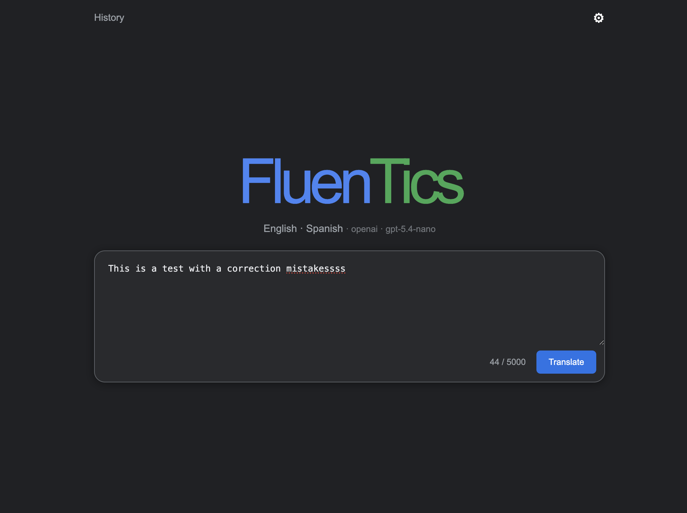
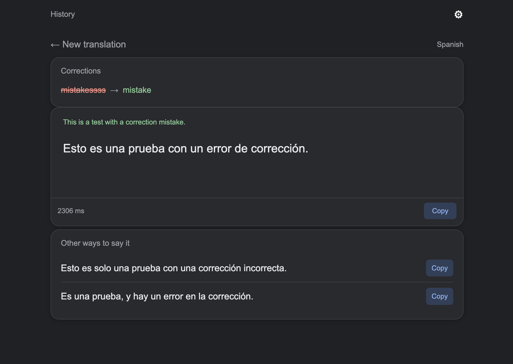

# FluenTics

[](https://github.com/micromante/fluentics/actions/workflows/tests.yml)

Private web application for translating between English and Spanish. It silently corrects mistakes in the input and shows only the final translation. Press `Enter` to translate and `Shift+Enter` to insert a line break.

## Run with Docker

```bash
docker compose up -d --build
```

Open `http://LXC_IP:8080`.

## Screenshots

### Translation input



### Translation result and corrections



## Configure providers and models

The default provider is OpenAI with `gpt-5.4-nano` as the primary model and `gpt-5-nano` as the fallback. All settings are configured from the web interface; no `.env` file is required.

Supported providers:

- OpenAI
- Claude (Anthropic)
- Gemini (Google)
- Grok (xAI)
- DeepSeek

The provider, primary model, fallback model, translation direction, prompt, and all provider API keys can be configured from the web settings panel. API keys are stored in the persistent Docker volume `fluentics-data` and blank key fields preserve the existing value. Since the settings panel displays the configured keys, protect access to the private application.

## Web configuration

Click the gear icon to change the provider, primary/fallback models, translation direction, prompt, and API keys. Changes are saved to the persistent Docker volume and persist when the container is recreated. Do not use `docker compose down -v` unless you intentionally want to delete the stored configuration.

## Translation history

Successful translations are saved in the persistent Docker volume. Open History from the top bar to reopen a complete result, delete individual entries, or clear the entire history.

## Tests

Unit tests do not call OpenAI or consume API credits:

```bash
pip install -r requirements.txt
pytest -q
```

The application is separated by responsibility: configuration, schemas, prompt, OpenAI service, routes, and frontend.
